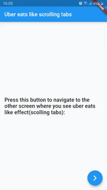

# uber_eats_scrolling_tabs
#### Author

  <kbd>
</img>
  </kbd>

#### An app that demonstrates how to achieve the scrolling tab bar effect as we see on uber eats.
#### It's not exactly like uber eats but very much similar to it.
#### It has some performance issues, but those can be fixed with some attention
#### Any improvements are heartily welcomed.
#### If you find any issues, don't forget to open an issue.
#### Please see the gif for the detail

#### You can use it at your need. I  would appreciate it if you star this repo if it helped you in any way
